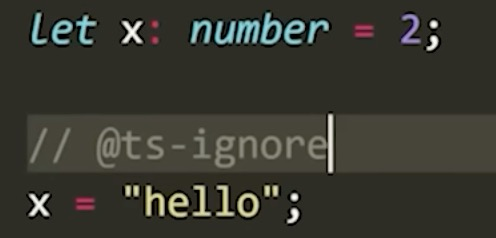
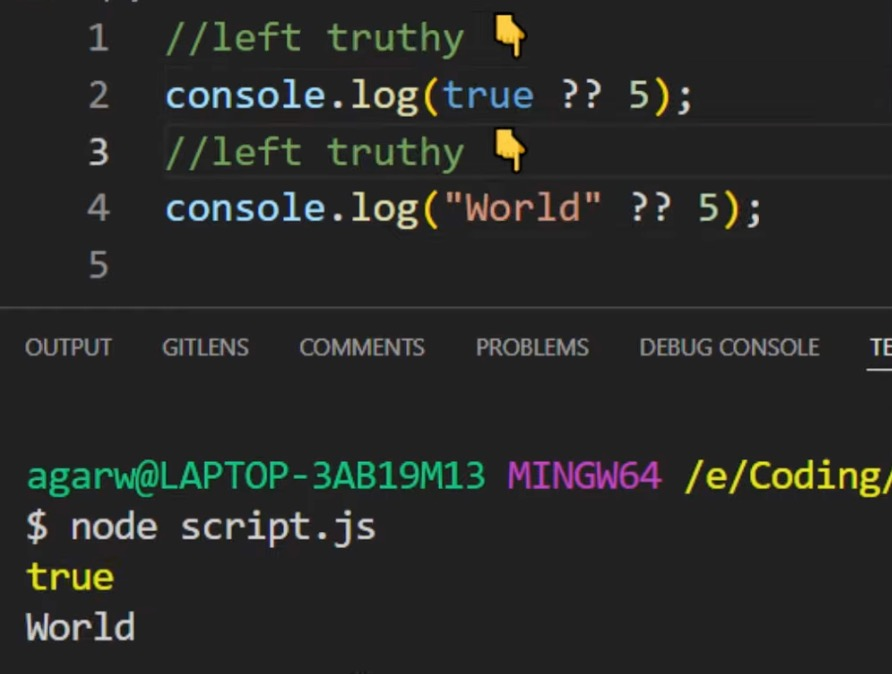

# learn-typescript-fullstackopen

### TypeScript consists of three parts :

1. The language :  
      - **syntax**
      - **keywords** 
      - **type annotations**
2. The compiler :
     - transpiles code from **.ts** to **.js**
     - **static code analysis** -> can emit warnings or errors if detected
     - can put generated **.js** files into specified file/folder.
3. Language service : 
     - intellisense 
     - type hints 
     - refactoring alternatives

### Key Language Features :

1. Type annotations
   
      - >`const birthdayGreeter = (name: string, age: number): string => {return `Happy birthday ${name}, you are now ${age} years old!`;
      }`
      - >**the intended contract** : birthdayGreeter function will accept two arguments: one of type string and one of type number. The function will return a string
1. Structural typing
     
     Two elements are considered identical to one another if, for each feature within the type of the first element, a corresponding and identical feature exists within the type of the second element. 

      ```javascript
     
       interface Person {
          name: string;
          age: number;
        }
        
        function greet(person: Person) {
          console.log(`Hello, ${person.name}!`);
        }
        
        const john = { name: 'John', age: 30 };
        greet(john); // This works because john has the same structure as Person
        
        const jane = { name: 'Jane', age: 25 };
        greet(jane); // This also works because jane has the same structure as Person
      ```
1. Type inference
     
      - Variables' type can be inferred based on their assigned value and their usage
     
          ```javascript
               const add = (a: number, b: number) => {
                /* The return value is used to determine
                   the return type of the function */
                return a + b;
                // inferred return type ( number )
              }
          ``` 
1. Type erasure 
      - i.e : No type information remains at runtime - nothing says that some variable x was declared as being of type SomeType
  
         >Input:
         >
         >let x: SomeType;

         >
         >Output After **Transpiling to .js** :
         >
         >
         >let x;

---

### Typescript Gotcha 
  
 > Even though you many not see any Typescript compile time errors, you can still come in to some kind of runtime error.
    >
    > This generally is seen in typescript apps the app is dealing with data request from external api's , whose data is not _known_ or _properly defined_ by the developer in the client  APP. 
    >
    > So be **extremely careful while declaring types for the data retrieved from external API's**

---
### Typescript Language Quirks 
   
   1. ####  Type Assertions :    
      - In some situations , typescript cannot know what type an element will convert to , in that case you can explicitly assert it to be of a specific type .
      - For example, if you’re using document.getElementById, TypeScript only knows that this will return some kind of HTMLElement, but _you might know that your page will always have an HTMLCanvasElement_ with a given ID.
  
        ```javascript
          
        const myCanvas = document.getElementById("main_canvas") as HTMLCanvasElement;
          
         // alternative syntax
        const myCanvas = <HTMLCanvasElement>document.getElementById("main_canvas");

        ```
      - TypeScript only allows type assertions which convert to a **more specific or less specific version of a type**. This rule _prevents “impossible” coercions_ like:
          
          `const x = "hello" as number;`

          >Conversion of type 'string' to type 'number' may be a mistake because neither type sufficiently overlaps with the other. If this was intentional, convert the expression to 'unknown' first.


  1. #### Type Narrowing :
      
      1. **typeof type Guards** : 
          1. "string"
          2. "number"
          3. "bigint"
          4. "boolean"
          5. "symbol"
          6. "undefined"
          7. "object" ( Plain objects eg: {} | Classes | Interfaces | Enums | Arrays | Functions | Promises )
          8. "function"    
   
         >Your need to confirm using `typeof` that a value is of a given type , to perform operations that are `specific to` the `given type`  

         ```javascript
          function padLeft(padding: number | string, input: string) {
            if (typeof padding === "number") {
             /* here we're only able to use repeat , 
              as padding is `confirmed to be a number` , 
              and not a string ,as the operation would be invalid 
              with `padding` having a string value.*/
             return " ".repeat(padding) + input;
                                  
            (parameter) padding: number
              }
              return padding + input;
                       
            (parameter) padding: string
          }   
         ```
      1. **Double-Boolean negation** : Put Double `!!` exclamation mark before any variable , to coerce it into a boolean value .
   
            >
            > const myVar = 'hello';  
            > const isTruthy = !!myVar; // true
            >
            > const myOtherVar = 0;  
            > const isTruthy2 = !!myOtherVar; //false   
            >
  
           + The following values are coerced to false 
              -  0
              -  NaN
              - "" (the empty string)
              - 0n (the bigint version of zero)
              - null
              - undefined
     
      1. **instanceof narrowing**
   
           - This only works for identifying `classes created using new` , which includes predefine classes like `Error` , `Object` , `Array`, `String`, `Number`, etc. It also works for  `user defined classes` eg : ` class Cat{ } `.  
           - `Does not work` for user defined `interfaces` or `types`

      1. **in operator narrowing**
           - JavaScript has an operator for determining if an object has a property with a name: the `in` operator.   
           - TypeScript takes this into account as a way to narrow down potential types.  
           - ```javascript
              type Fish = { swim: () => void };
              type Bird = { fly: () => void };
               
              function move(animal: Fish | Bird) {
                if ("swim" in animal) {
                  return animal.swim();
                }
               
                return animal.fly ();
              }
              
             ``` 
        1. **User defined type guards** 
           >A type guard is a function that returns a boolean value and has a special return type of       
            `variableName is Type`
            , where 
            variableName
             is the name of the variable being checked and 
            Type
             is the type you want to narrow it to.

             ```javascript
               interface Dog {
                  name: string;
                  breed: string;
                }
                
                interface Cat {
                  name: string;
                  color: string;
                }
                
                function isDog(animal: Dog | Cat): animal is Dog {
                  return (animal as Dog).breed !== undefined;
                }
                
                const myDog: Dog = { name: 'Fido', breed: 'Labrador' };
                const myCat: Cat = { name: 'Whiskers', color: 'gray' };
                
                function printAnimal(animal: Dog | Cat) {
                  if (isDog(animal)) {
                    console.log(`${animal.name} is a ${animal.breed} dog`);
                  } else {
                    console.log(`${animal.name} is a ${animal.color} cat`);
                  }
                }
                
                printAnimal(myDog); // "Fido is a Labrador dog"
                printAnimal(myCat); // "Whiskers is a gray cat"
             ```
            + In this example, we have two custom defined types: 
                    `Dog
                     and 
                    Cat`
                    . We also have a function called 
                    `isDog`
                     that takes an 
                    animal
                     parameter of type 
                    Dog | Cat and returns a boolean value. The   `function checks if` the 
                    animal
                     `parameter is a Dog by checking if it has a breed property`.
            + We then have a 
                `printAnimal`
                 function that takes an 
                animal
                 parameter of type 
               `Dog | Cat`
                . Within the function, we use the 
                `isDog`
                 type guard to `narrow the type of 
                animal
                 to 
                Dog`
                 if it is a dog, or to 
                Cat
                 if it is a cat. We can `then safely access` the `properties` of the 
                animal
                 object `based on its type`.
      

      1. **Discriminated Union**
         
         - Using a discriminated union, and can narrow out the members of the union.
   
            ```javascript
              interface Circle {
                  kind: "circle";
                  radius: number;
                }
                 
                interface Square {
                  kind: "square";
                  sideLength: number;
                }
                 
                type Shape = Circle | Square;

              function getArea(shape: Shape) {
                  switch (shape.kind) {
                    case "circle":
                      return Math.PI * shape.radius ** 2;
                                        
                       // shape: Circle
                      case "square":
                        return shape.sideLength ** 2;
                                
                     // shape: Square
                    }
                }

            ```
          - In this case, `kind` was that _common property_ (which is what’s considered a discriminant property of Shape). Checking whether the kind property was "circle" got rid of every type in Shape that didn’t have a kind property with the type _"circle"_. That `narrowed shape down to the type Circle`. 
          -  From there, the type system was able to do the “right” thing and figure out the types in each branch of our switch statement.
        

      1. **Exhaustiveness checking**

          - >The
          **never
          type** :
          When narrowing, you can reduce the options of a union to a point where you have removed all possibilities and have nothing left. In those cases, TypeScript will use a never type to _**represent a state which shouldn’t exist**_.

          - `Using 
          never`
           `in` the 
          `default
           case` is a powerful `way to ensure that our code is exhaustive` and `catches errors at compile-time`.

              ```javascript
              type Color = 'red' | 'green' | 'blue';

            function getColorName(color: Color) {
                switch (color) {
                  case 'red':
                    return 'Red';
                  case 'green':
                    return 'Green';
                  case 'blue':
                    return 'Blue';
                  default:
                    const exhaustiveCheck: never = color;
                    return exhaustiveCheck;
                }
            }
              ```
        - If we were to `add` a new color to the 
          `Color
           type, say 'yellow'`, and `forget to add a corresponding case` in the switch statement, TypeScript would throw a `compile-time error`. This is because we have not covered all possible cases of the 
          Color
           type, and TypeScript wants `to ensure that we handle all cases`.  
          
          >`Error : Type 'Yellow' is not assignable to type 'never'.`    

     ---
     
     >Tip : To ignore any typescript error , if you don't find a quick fix for it ... just put `//@ts-ignore` on top of the line giving the ts `error`   
     
      
## Creating Custom Types :   

1. Union Type :
      `type Operation = 'multiply' | 'add' | 'divide';`  ( This is called a `Union Type`)  
      _Where ever you use this as a type , you'll have to provide either of the 3 values specified , for it to be a valid assignment._  
1. Utility Types :   
    1. The `Pick` utility type allows us to choose which fields of an existing type we want to use. Pick can be used to either construct a completely new type or to inform a function what it should return on runtime. 
       > Example usecase , if don't want to get sensitive information like `password` from the backend , we can confirm the same using Pick , and check if the data we received does not include the `password` field .
       >
       >If we still get the `password` from the backend, then it will error .
   
       ```javascript
         const getNonSensitiveEntries =
          (): Pick<DiaryEntry, 'id' | 'date' | 'weather' | 'visibility'>[] => {
            // ...
          }
       ```
    2. The `Omit` utility type : A better way to implement the same type safety for for the above scenario is to use the `Omit` utility type to just create a type by omitting the `password` field.
     
     ```javascript
        const getNonSensitiveEntries =
          (): Pick<DiaryEntry, 'password'>[] => {
            // ...
          }
     ```


> `Quick Tip` : So if, for example, your values comes from an external interface, there is no definite guarantee that it will be one of the allowed values , specified by you in the type definition.  
> 
> Therefore, it's still better to include error handling and be prepared for the unexpected to happen, when getting data from external sources.

## Error Handling in TypeScript : 

> _*Unknown* :  The `unknown` was introduced to be the type-safe counterpart of `any`._  
> 
> _Anything is assignable to unknown and no `operations are permitted on an unknown without first asserting or narrowing it` to a more specific type._

_The `default type` of the `error object` in TypeScript is `unknown`.     
So we have to `narrow the type` to access the `message` field like so :_
   
   ```javascript
     try{

     }
     catch (error: unknown) {

      let errorMessage = 'Something went wrong: '

      // here we can not use error.message
      
      //Here the narrowing was done with the instanceof type guard   
      if (error instanceof Error) { 
     
        //  narrowing through type assertion will also work
        
        //  const err =error as Error
        //  console.log(err.message)

        // the type is now narrowed to Error and we can refer to error.message
         errorMessage += error.message;
        }

        // here we can not use error.message
    
        console.log(errorMessage);
    }

   ```
---
### Accessing command line arguments :
 
  We can do that using : `process.argv`  

  > ( accessing the command line arguments 
  > console.log(process.argv.slice(2)) 
  >  will get the two command line values given in ( ts-node calculator.js 4 5 add)
  > 
  > So i this case we'll get an array of 2 strings ['4','5','add]
)

---

## Validating data obtained from external sources :

`validate the data given to us from the command line, to avoid invalid data from external sources.`

```javascript

  interface InputValues {
    value1: number;
    value2: number;
    operation:string;
  }
  
  const parseArguments = (args: string[]): InputValues => {
    if (args.length < 5) throw new Error('Not enough arguments');
    if (args.length > 5) throw new Error('Too many arguments');
  
    if (!isNaN(Number(args[2])) && !isNaN(Number(args[3]) ) {
      return {
        value1: Number(args[2]),
        value2: Number(args[3]),
        operation:args[4]
      }
    } else {
      throw new Error('Provided values were not numbers!');
    }
  }
  
```

###  Nullish Coalescing ( not specifically a typescript feature , but  a part of native javascript ) :
  
  If the `lsh` is true , then the LHS will be applied ,but if it's false, then the RHS will be applied

  

---

>TypeScript Quirk: somehow surprisingly TypeScript does not allow to define the same variable in many files at a "block-scope", that is, outside functions (or classes):
>
>`This is actually not quite true`. This rule applies only to files that are treated as "scripts". A file is `a script if it does not contain any export or import statements. If a file has those, then the file is treated as a module`, and the variables do not get defined in the block-scope.

---
 ## CONFIG  

1. Use `npm init -y` to  initialize a new node project
   
2. By using the npm package `ts-node`, you can compile and `executes` the specified `TypeScript file immediately` so that there is `no` need for a `separate compilation step`. ( Good for testing , but not to be used in production) 
   <br/>
   <br/>
   
      -  You can `install` both `ts-node` and the official `typescript` package `globally` by running
         ```bash 
              npm install -g ts-node typescript       
         ```
3. Add a configuration file `tsconfig.json` to the project with the following content.  
  The tsconfig.json file is used to 
   + define how the TypeScript compiler should interpret the code
   +  how strictly the compiler should work
   +  which files to watch or ignore
   
    ```json
             {
          "compilerOptions":{
            "noImplicitAny": true // this will not allow  'any' type to exist . 
                          // If this is turned to false , the default type would be 'any'
          }
        }
    ```
 1. You can directly use `ts-node` to execute a `typescript` file like so : `ts-node test.ts` OR you could install `ts-node` as a `dev-dependency` and run it using an `npm script` in `package.json`  , like so : `npm run ts-node test.ts`
    
      ```json
  
     // package.json:  
           {
  
          "scripts": {
            "ts-node": "ts-node"
            },
          
          }
  
      ```

    >  The VSCode plugin is so efficient, that it informs you immediately when you are trying to use an incorrect type.
    
    \-\-\-    
    [multiplication with correct and incorrect arguments](./multiplicator.ts)   
    \-\-\- 


1. Installing types for the packages you use :
`@types/ prefix.` ( always install as dev dependency )

    For example:
    ```bash
    
    npm install --save-dev @types/react @types/express @types/lodash @types/jest @types/mongoose
    
    ```

1. Let's specify the following configurations in our tsconfig.json file:
     ```javascript
    
      {
        "compilerOptions": {
          "target": "ES2022",
          "strict": true,
          "noUnusedLocals": true,
          "noUnusedParameters": true, // this raises an error when unused params are present . You can put an underscore on its starting `_param` to get rid of this error
          "noImplicitReturns": true,
          "noFallthroughCasesInSwitch": true,
          "noImplicitAny": true,
          "esModuleInterop": true,
          "moduleResolution": "node"
        }
      }
     
     ```
1. Let us start by installing Express:

     `npm install express`

1. And then add the start script to package.json:

    ```json
    
    {
      // ..
      "scripts": {
        "ts-node": "ts-node",
        "start": "ts-node index.ts"
      },
      // ..
    }
    ```
1. create the file index.ts, and write the HTTP GET *ping endpoint to it:
   
    ```javascript
       
            // using this import statement [ import express from 'express';]  while importing express will lead to the req and res to  automatically infer the types

            import express from 'express';

            const app = express();
            
            app.get('/ping', (req, res) => {
              res.send('pong');
            });
            
            const PORT = 3003;
            
            app.listen(PORT, () => {
              console.log(`Server running on port ${PORT}`);
            });
           
      ```

      >A good rule of thumb is to try importing a module using the import statement first. We will always use this method in the frontend. If import does not work, try a combined method: import ... = require('...').

1. Install the types for express :   
   `npm install --save-dev @types/express`

1. Enable auto-reloading to improve our workflow by Installing `ts-node-dev` :

      _As *nodemon* is to *node* , so is *ts-node-dev* to *ts-node*_
    
      `ts-node-dev takes care of recompilation on every change, so restarting the application won't be necessary.`
      
      ```bash
    
      // (Install as dev dependency)
    
      npm install --save-dev ts-node-dev
      
      ```

1. Add a script to package.json:

   ```json
    {
      // ...
      "scripts": {
          // ...
          "dev": "ts-node-dev index.ts",
      },
      // ...
    }

   ```

    >now, by running `npm run dev`, we have a working, auto-reloading development environment for our project.
  
1. Extracting query values from a query string URL :

   `http://localhost:3002/bmi?height=180&weight=72.` 

   To get the values of `height` and `weight`, from the query string, we use the built in  `qs` module , like so : 

     ```javascript
      import qs from 'qs';
        
        app.get('/bmi',(req, res) => {
    

        const query = qs.stringify(req.query);
         
        const { height, weight } = qs.parse(query);

         // do whatever you need to do with it

        }

     ``` 
1. Setting proper `ES-Lint`  settings to not allow `explicit any` .
  
      >When you extract the `body` property from the request in an express app, the compiler does not complain to type checking the values in the body , as `express explicitly gives` the values an `any property`.
     >
      >This is not caught by the `.tsconfig` settings, as till now , `we've only disallowed implicit any` . Using values typed explicitly as any from the express body is a problem , as you're not sure what types they actually are of , and then passing them through the functions could create issues if the values are not of the expected type.
      >
      >To avoid this problem , we need define proper rules in   `.eslintrc`  to `disallow the use of explicit any`, and `only use values that are verified` to belong to a specific type, using type guards.   

      
    ---

      _`typescript-eslint` enables ESLint to run on TypeScript code_

      ---

    1. Install the following :  

         `npm install --save-dev eslint @typescript-eslint/eslint-plugin @typescript-eslint/parser`  
           

    1.  set up a lint npm script to inspect the files with .ts extension by modifying the package.json file.
        
          ```json
             \\ package.json
  
             scripts: {
                   "lint": "eslint --ext .ts ."
             }
               //Now lint will complain if we try to define a variable of type any
          ```  

     1.  Put the following recommended  `@typescript-eslint` settings  in your `.eslintrc` file : 
   
         ```json
         
           {
                "extends": [
                  "eslint:recommended",
                  "plugin:@typescript-eslint/recommended",
                  "plugin:@typescript-eslint/recommended-requiring-type-checking"
                ],
                "plugins": ["@typescript-eslint"],
                "env": {
                  "node": true,
                  "es6": true
                },
                "rules": {
                  "@typescript-eslint/semi": ["error"],
                  "@typescript-eslint/explicit-function-return-type": "off",
                  "@typescript-eslint/explicit-module-boundary-types": "off",
                  "@typescript-eslint/restrict-template-expressions": "off",
                  "@typescript-eslint/restrict-plus-operands": "off",
                  "@typescript-eslint/no-unused-vars": [
                    "error",
                    { "argsIgnorePattern": "^_" }
                  ],
                  "no-case-declarations": "off"
                },
                "parser": "@typescript-eslint/parser",
                "parserOptions": {
                  "project": "./tsconfig.json"
                }
              }
           ```

      1. Now , you would get an error while getting the values from the `request.body` , so we need to disable the warning on that line, so as to properly parse the values henceforth , before use .  And we can do that by putting the `eslint-disable-next-line [name of the rule to disable]`  **comment right above the erroring line** ,like so : 
   
           ```javascript
             
              app.post('/calculate', (req, res) => {

              // eslint-disable-next-line @typescript-eslint/no-unsafe-assignment 
              const { value1, value2, op } = req.body; // this will error if the eslint-disable comment is not mentioned right above it .
              
               // Now we can pass the values through type guards , and other types of validation criterial ,to validate the types of the values.
               if ( !value1 || isNaN(Number(value1)) ) {
                return res.status(400).send({ error: '...'});
              }

              // The `op` variable , should be of type `Operation`, but since that's not been verified , you'll get an eslint error when calling the function calculate(v1,v2,op), so ,   we can either silence the eslint rule like above ,   or assert it's type as Operation, while passing it in . This is not ideal , as ideally , you should to `type narrowing` using type-guard function instead.

               const result = calculator(
                  Number(value1), Number(value2), op as Operation // this will get rid of the eslint error
                ); 
              
                return res.send({ result });

           ```

  ---
